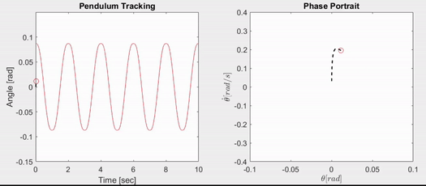

# Hierarchical Model-Free Control Framework for Underactuated Mechanical Systems

## Description
This project proposes a hierarchical model-free control framework to generate stable limit cycle generation for underactuated mechanical systems. The framework utilizes a high-level control structure that generates reference trajectories while maintaining stable internal dynamics. We then propose a low-level model-free controller for the underactuated system, which is utilized to track those reference trajectories on the unactuated coordinates. The proposed framework provides excellent tracking while maintaining the robustness and stability analysis of the low-level controller. We evaluate our proposed framework on the Rotary Inverted Pendulum (RIP), Vertical Take-Off and Landing (VTOL) aircraft model, both in simulation and on experimental hardware, and in simulation only for the leg-foot model on deformed ground.

This repository offers all necessary materials for implementing and testing the framework, including software simulations in Matlab Simulink 2023b and hardware demonstrations using QNET 2.0 Rotary Pendulum with NI LabVIEW Suite 2021.

## Paper and Video References

The work is published in IEEE Robotics and Automation Letters 2023. The hardware experiment video of the framework application is featured in [IEEE Spectrum Video Friday](https://spectrum.ieee.org/video-friday-acromonk).

Further links:
* Paper is available on [IEEE](https://ieeexplore.ieee.org/document/10106397) and [arXiv](https://arxiv.org/abs/2305.08373).
* Video is available on [YouTube](https://youtu.be/OIwE66wXiWY).

## Documentation

The dynamics of the framework are explained [here](hardware/acrm-equations.md). Additionally, [mechatronics design](hardware/testbench-description.md), [behavior generation](software/python/simulation/behavior_generation/README.md), and [control](software/python/simulation/behavior_control/README.md) for continuous operation are described in their respective readme files.

* [Mechatronics Design](hardware/testbench-description.md)
* [Behavior Generation](software/python/simulation/behavior_generation/README.md)
* [Behavior Control](software/python/simulation/behavior_control/README.md)
* [Software Guide](software/python/README.md)
* [Bill Of Materials (BOM)](hardware/bills-of-materials.md)

The CAD file is also provided on grabCAD.com. You can use the 3D viewer from their website to display the 3D model directly within your browser.
 - [Display AcroMonk in 3D](https://grabcad.com/library/acromonk-1)

## Authors

* [Shivesh Kumar](https://robotik.dfki-bremen.de/en/about-us/staff/person/shku02) (Project Supervisor)
* [Mahdi Javadi](https://robotik.dfki-bremen.de/en/about-us/staff/person/maja04) (Hardware and Software Maintainer, Trajectory Optimization and Stabilization)
* [Daniel Harnack](https://robotik.dfki-bremen.de/en/about-us/staff/daha03.html) (Software Maintainer, Reinforcement Learning)
* [Shubham Vyas](https://robotik.dfki-bremen.de/en/about-us/staff/person/shvy01) (Trajectory Optimization, Hardware Concept)
* [Daniel Pizzutilo](https://robotik.dfki-bremen.de/de/ueber-uns/mitarbeiter/dapi01) (Mechatronics Design)
* Paula Stocco (Trajectory Optimization and Stabilization)
* Muhammad Rafey Tahir (Hierarchical Control Framework Development)

Feel free to contact us if you have questions about the test bench. Enjoy!

## Contributing

1. Fork it (<https://github.com/yourname/yourproject/fork>)
2. Create your feature branch (`git checkout -b feature/fooBar`)
3. Commit your changes (`git commit -am 'Add some fooBar'`)
4. Push to the branch (`git push origin feature/fooBar`)
5. Create a new Pull Request

## Safety Notes

When working with a real system, be careful and mind the following safety measures:

* Brushless motors can be very powerful, moving with tremendous force and speed. Always limit the range of motion, power, force, and speed using configurable parameters, current-limited supplies, and mechanical design.
* The robot must be placed in a secure environment and kept at least one meter away during operation.
* Ensure you have access to an emergency stop while conducting experiments. Be extra careful while operating in the pure torque control loop.
* The robot is equipped with an onboard Lithium Polymer battery that requires proper care and attention. Make sure you have all necessary information regarding LiPo batteries.

## Acknowledgments

This work has been performed in the M-RoCK project funded by the German Aerospace Center (DLR) with federal funds (Grant Number: FKZ 01IW21002) from the Federal Ministry of Education and Research (BMBF) and is additionally supported with project funds from the federal state of Bremen for setting up the Underactuated Robotics Lab (Grant Number: 201-342-04-2/2021-4-1). The fourth author acknowledges support from the Stardust Reloaded project which has received funding from the European Union’s Horizon 2020 research and innovation program under the Marie Skłodowska-Curie grant agreement No 813644.

## License

This work has been released under the BSD 3-Clause License. Details and terms of use are specified in the LICENSE file within this repository. Note that we do not publish third-party software, hence software packages from other developers are released under their own terms and conditions, e.g., Stable baselines (MIT License) and TensorFlow (Apache License v2.0). If you install third-party software packages along with this repo, ensure you follow each individual license agreement.

## Citation

1. Javadi M., Harnack D., Stocco P., Kumar S., Vyas S., Pizzutilo D., Kirchner F., (2022). AcroMonk: A Minimalist Underactuated Brachiating Robot. In: IEEE Robotics and Automation Letters (RA-L), vol. 8, no. 6, pp. 3637-3644, June 2023, doi: 10.1109/LRA.2023.3269296.
