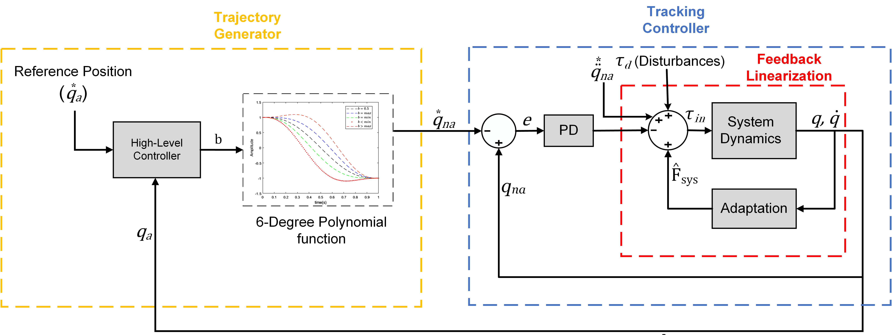

# Hierarchical Model-Free Control Framework for Underactuated Mechanical Systems

## Description
This project proposes a hierarchical model-free control framework to generate stable limit cycle generation for underactuated mechanical systems. The framework utilizes a high-level control structure that generates reference trajectories while maintaining stable internal dynamics. We then propose a low-level model-free controller for the underactuated system, which is utilized to track those reference trajectories on the unactuated coordinates. The proposed framework provides excellent tracking while maintaining the robustness and stability analysis of the low-level controller. We evaluate our proposed framework on the Rotary Inverted Pendulum (RIP), Vertical Take-Off and Landing (VTOL) aircraft model, both in simulation and on experimental hardware, and in simulation only for the leg-foot model on deformed ground.

This repository offers all necessary materials for implementing and testing the framework, including software simulations in Matlab Simulink 2023b and hardware demonstrations using QNET 2.0 Rotary Pendulum with NI LabVIEW Suite 2021.

## Paper and Video References

Further links:
* Video is available on [YouTube](https://youtu.be/OIwE66wXiWY).

## Authors
* Muhammad Rafey Tahir (Hierarchical Control Framework Development)

Feel free to contact us if you have questions about the test bench. Enjoy!

## Contributing

1. Fork it (<https://github.com/yourname/yourproject/fork>)
2. Create your feature branch (`git checkout -b feature/fooBar`)
3. Commit your changes (`git commit -am 'Add some fooBar'`)
4. Push to the branch (`git push origin feature/fooBar`)
5. Create a new Pull Request

## Safety Notes

When working with a real system, be careful and mind the following safety measures:

* Brushless motors can be very powerful, moving with tremendous force and speed. Always limit the range of motion, power, force, and speed using configurable parameters, current-limited supplies, and mechanical design.
* The robot must be placed in a secure environment and kept at least one meter away during operation.
* Ensure you have access to an emergency stop while conducting experiments. Be extra careful while operating in the pure torque control loop.
* The robot is equipped with an onboard Lithium Polymer battery that requires proper care and attention. Make sure you have all necessary information regarding LiPo batteries.

## Acknowledgments

This work has been performed in School of Electrical Engineering and Computer Sciences at National University of Sciences and Technology, Pakistan. 

## License

## Citation
